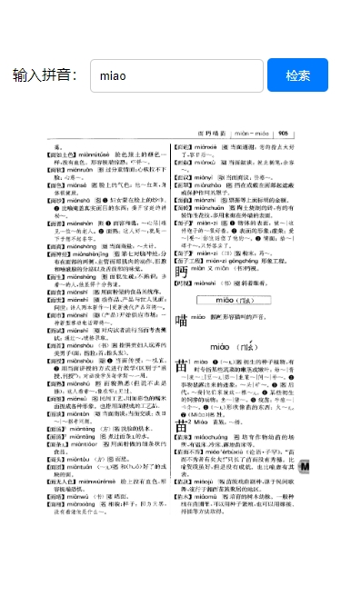

 

## 背景 Background
网络上的现代汉语词典其实都挺麻烦的，装个APP对于我来说很不方便，相信对很多实际使用者来说也很不友好。而且用mdx可能也会出错需要校对。所以我就搞了个网页版的，直接显示扫描图片。这样子才是原汁原味的感觉。

All other Modern Chinese Dictionaries on the net is in fact not so handy. It's strange to install an app for one-time use situation. I believe most users share the common feeling. Besides, mdx file may need revision as it's tranformed form pdf, as you know, people make mistakes. I prefer pdf file, therefore, I make it a web verion, showing the scanned pictures. To me, that's the solution -- trustworthy and convenient.

## 特点 Features
- 电脑手机都能用，主要是手机 
  
  Available on both mobile & PC
- 左右半屏翻页，仿真电子书设计 
  
  Click the screen and go to previous/next page
- 顶部搜索框，比目录更佳的解决方案 
  
  Search input rather than menu
- 图片压缩率 60%

  Compressed pictures by 60%

## 效果展示 Screenshot

## 计划上线 Upcoming
- 极致压缩图片 
  
  Ultra lossless image compression
- 文字、词语搜索 
  
  Chinese character/word searching

## 打赏 Reward
如果你觉得本网站好用，可以点一个免费的Star或者Fork。谢谢

If you find this website useful, please give me a Star or Fork. Thank you

